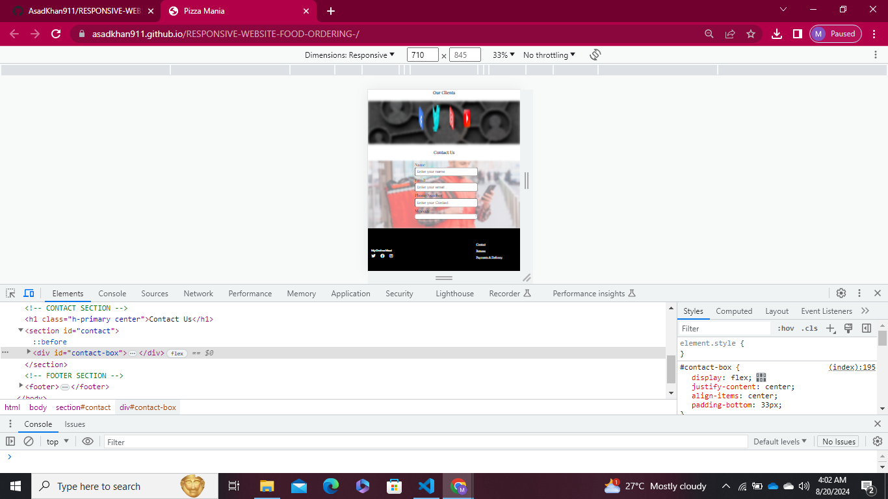

# Responsive Website - Food Ordering

## Project Overview

This project is a responsive website for food ordering. It demonstrates the use of HTML, CSS, and responsive design techniques to create a functional and visually appealing website that works well on both web and mobile devices.

## Features

- **Responsive Design**: The website adjusts to various screen sizes, including desktops, tablets, and mobile phones.
- **Interactive UI**: Includes interactive elements for a better user experience.
- **Modern Styling**: Clean and attractive design optimized for food ordering.

## Demo

You can view the live demo of the project by clicking the link below:

[**Demo View**](https://your-demo-link.com)

## Demo Images

Here are some screenshots of the responsive website:

### Web View

1. 
2. 

### Mobile View

1. 
2. 

## Technologies Used

- HTML
- CSS
- Responsive Design Techniques

**License**:
   - Ensure you have a `LICENSE` file in your repository if you mention it in the README.

This README will provide a clear overview of your project, including its responsiveness, demo links, and images showcasing both web and mobile views.
